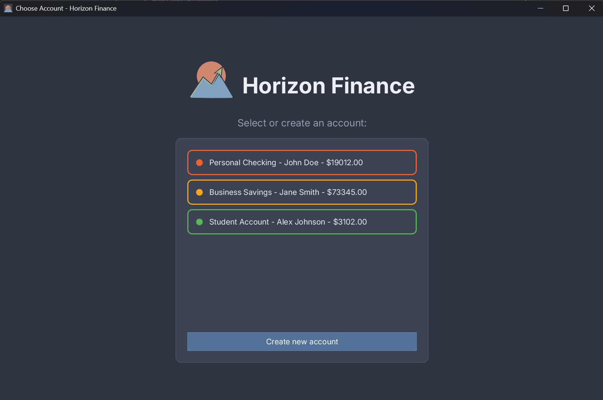
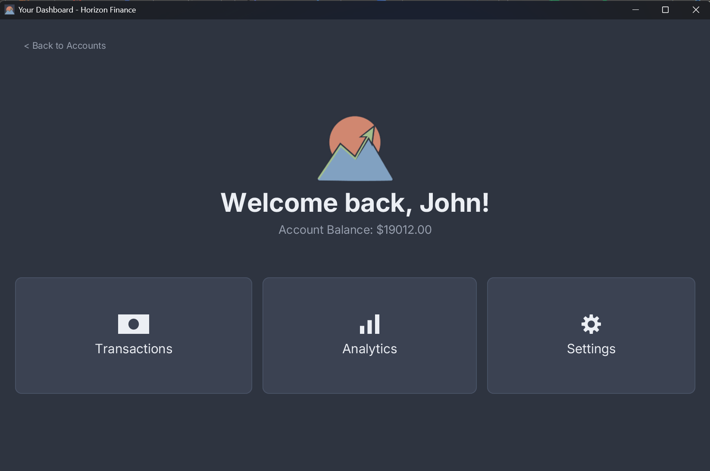
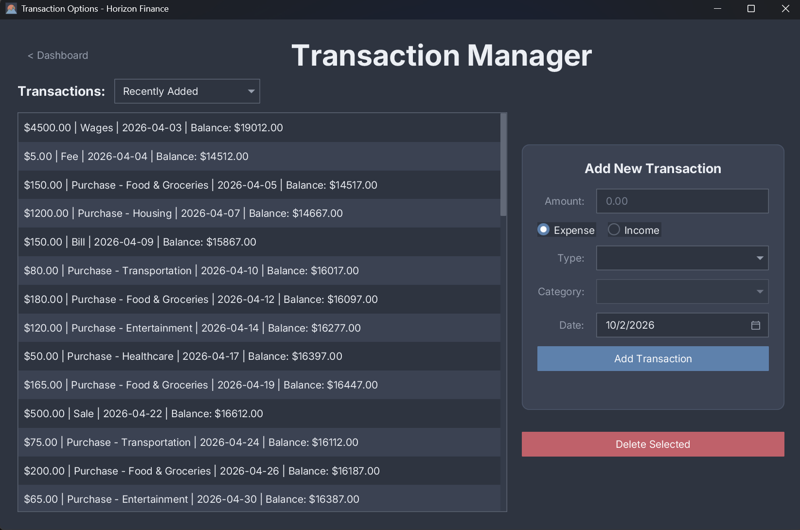
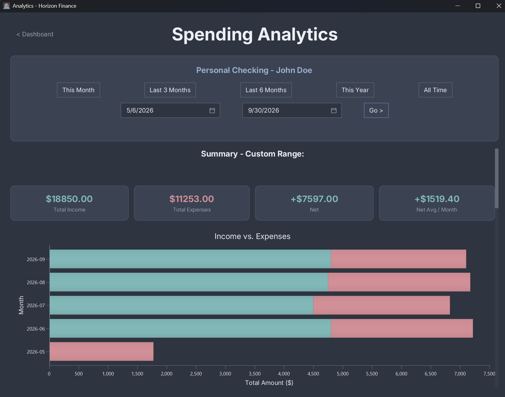

# Horizon Finance

Horizon Finance is a local app built for Windows that allows you to track and analyze your income and spending as simply as it needs to be!

## Installation
Download the latest release [here](https://github.com/dprieto12/horizon-finance/releases/tag/v1.0.3),
extract the zip, and run **Horizon.exe**. No Java installation required.

**Supported:** Windows 10/11

## Project Overview
* **Role:** Head Developer
* **Context:** Summer 2026 Freshman Capstone Project
* **Languages, Tools, and Libraries:** Java, SQLite, JavaFX, CSS, Scene Builder, Git/GitHub, IntelliJ, Maven
* **Status:** Complete / Production Build (v1.0.0)
* **Support:** Built & Optimized for Windows 10/11

---

## Screenshots

---

## About the App
* **Create Accounts:** Users can make multiple different accounts and easily switch between them to keep financial data separate.
* **Add Transactions:** View, add, and remove recent transactions to update your income and expense data.
* **Analyze Your Spending:** Make key insights from your finances over any period of time with clean charts and graphs.
* **Entirely Secure:** Horizon keeps all your data right on your device and nowhere else, without the need for logins or a network connection!

---

## Key Implementations
* **MVC Architecture:** Architected the application following the Model-View-Controller (MVC) pattern, separating data models (`Account`, `Transaction`), JavaFX FXML views managed via Scene Builder, and Controller classes handling user interaction and business logic delegation to `DatabaseManager`.
* **SQLite & JDBC:** Engineered a `DatabaseManager` class that uses Java's Database Connectivity API to create and interface with a local SQLite database for persistent data storage. All data lives on the user's device at `%APPDATA%/HorizonFinance/` and is never transmitted anywhere.
* **JavaFX & CSS:** Built the application's front end using JavaFX styled with CSS and AtlantaFX's Nord Dark theme, with Controller classes receiving and sending information via data models to create accounts and transactions along with transactional analytics.
* **JUnit Testing:** Wrote a suite of unit and integration tests using JUnit 5, covering database CRUD operations, model logic, and utility methods against an isolated temporary database to ensure correctness without touching production data.

---

## About

Developed by David Prieto · Summer 2026

Built as a personal project following a Software Engineering in Java course at California Baptist University,
demonstrating full-stack desktop application development from database architecture
and MVC design to UI styling and application packaging.

* **GitHub:** [github.com/dprieto12](https://github.com/dprieto12)
* **LinkedIn:** [linkedin.com/in/david-j-prieto](https://www.linkedin.com/in/david-j-prieto)